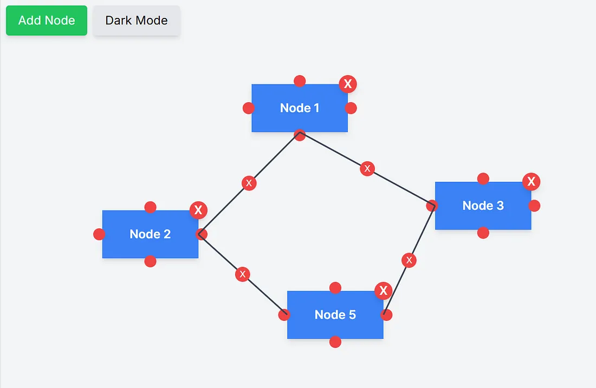
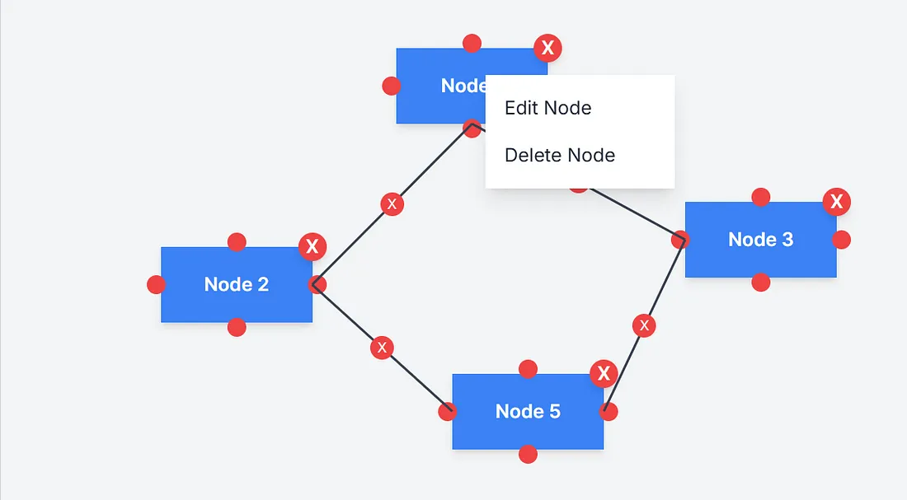
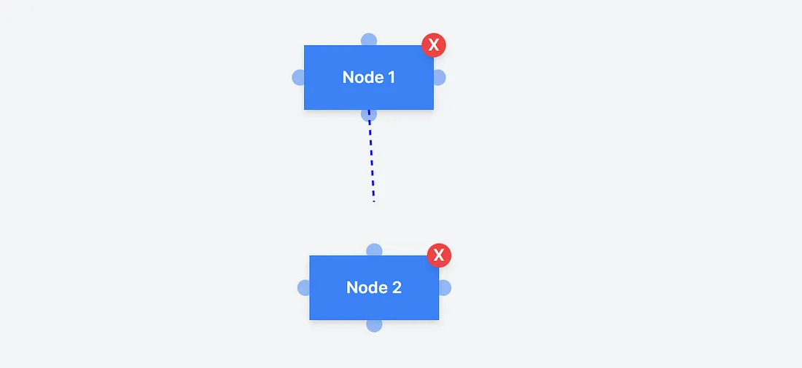

# **Custom Workflow Builder**

A lightweight, customizable workflow builder built with **React** and **TailwindCSS**. This tool enables users to create and visualize workflows with drag-and-drop nodes, interactive connections, and a clean, modern UI.

## **Features**

- 🖱️ Drag-and-drop nodes.
- 🔗 Create and manage interactive connections.
- 🎛️ Custom context menu for node actions.
- 🌙 Dark mode toggle for better accessibility.
- ⚡ Built with React and styled using TailwindCSS.

---

## **Preview**

### **Workflow Builder**


### **Context Menu**


### **Edge Drawing**



---

## **Getting Started**

### **Prerequisites**

Before running the project, ensure you have the following installed:
- Node.js (v16+)
- npm or yarn
- A code editor (e.g., VSCode)

### **Installation**

1. Clone the repository:
   ```bash
   git clone https://github.com/your-username/workflow-builder.git
   cd workflow-builder
   ```

2. Install dependencies:
   ```bash
   npm install
   # or
   yarn install
   ```

3. Start the development server:
   ```bash
   npm run dev
   # or
   yarn dev
   ```

4. Open your browser and navigate to `http://localhost:3000`.

---

## **Code Structure**

| File/Folder                | Description                                                                                                                      |
|----------------------------|----------------------------------------------------------------------------------------------------------------------------------|
| `app/page.tsx`             | The entry point of the application.  you need to add `style={{ width: "100%", height: "100%" }}` to the parent component of canvas |
| `components/Canvas.tsx`    | The main canvas to render nodes and connections.                                                                                 |
| `components/Node.tsx`      | The individual node component with drag-and-drop functionality.                                                                  |
| `components/Connection.tsx` | Handles the rendering of connections between nodes.                                                                              |

---

## **Customization**

### **Adding Nodes**
Nodes are dynamically added by clicking the **"Add Node"** button. Each node includes:
- A draggable interface.
- Connectable edges (top, bottom, left, right).
- A delete button for easy removal.

### **Connecting Nodes**
Click on an edge of one node and then click on the edge of another node to create a connection.

### **Dark Mode**
Toggle dark mode with the **"Dark Mode"** button in the top-left corner.

---

## **Future Improvements**

- 🌟 **Node Customization:** Allow renaming and adding icons/colors to nodes.
- 💾 **Save/Load Workflows:** Export and import workflows as JSON.
- ⚡ **Keyboard Shortcuts:** Streamline user interaction.

---

## **Contributing**

Contributions are welcome! 🎉  
Feel free to submit issues or pull requests to enhance the project.

### **Steps to Contribute:**
1. Fork the repository.
2. Create a new branch:
   ```bash
   git checkout -b feature/your-feature-name
   ```
3. Commit your changes:
   ```bash
   git commit -m "Add your message here"
   ```
4. Push to your fork and submit a pull request.

---

## **License**

This project is licensed under the **MIT License**.  
Feel free to use, modify, and distribute it as per the license terms.

---

## **Contact**

Have questions or suggestions?  
Feel free to reach out or drop an issue on GitHub!  
[Thimira Nirmal](https://timnirmal.com) | [LinkedIn](https://www.linkedin.com/in/thimiranirmal/)
